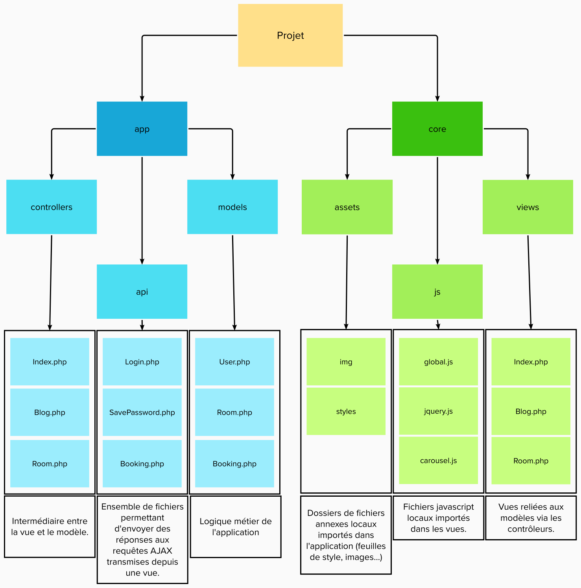

# Booking
**MidRing Agency** a été mandatée pour la conception, le développement et la réalisation d'un projet "prototype" portant sur un système de gestion et réservation de chambres d'hôtel. Ce projet est destiné à un particulier qui ne souhaite pas intégrer de réels systèmes de paiement automatisés, mais simplement un prototype de réservation et gestion de chambres d'hôtel, de gestion et consultation d'événements, de rédaction et lecture d'articles de blog, et de gestion de clientèle. Il nécessite ainsi d'intégrer, à titre d'exemple, un système de sessions permanentes, ou encore de gestion de droits d'utilisateurs.

## Contraintes de développement
- Le site doit être dynamique et codé en PHP objet. L'utilisation d'un framework PHP de type Symfony ou Zend est interdite car le mélange de code préfabriqué et de code personnel en rend l'évaluation difficle.
- Le site doit être interfacé avec une base de données MariaDB.
- Les données de base doivent pouvoir être modifiées en ligne, de manière sécurisée, par des utilisateurs autorisés (session).
- Le code HTML5 (statique ou généré par PHP) et les feuilles de style CSS doivent être valides.
- Le site doit être le plus accessible possible.
- L'aspect du site doit être professionnel (il est autorisé d'utiliser des templates existants).
- Le site doit adopter l'architecture MVC et utiliser des gabarits afin que les langages utilisés dans sa conception (HTML, CSS, PHP et SQL) soient strictement séparés.
- Le site doit être accessible en ligne.

## Arborescence du projet
Voici une représentation structurelle de l'arborescence du projet. Les listes à l'intérieur des rectangles noirs sont, pour la plupart, non-exhaustives :
